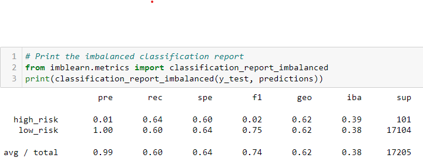
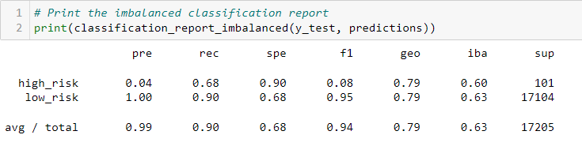
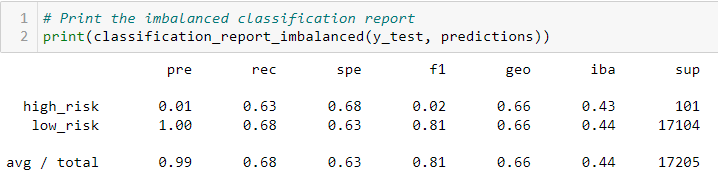
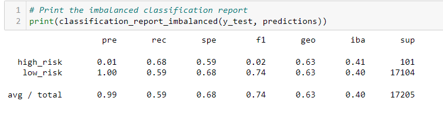
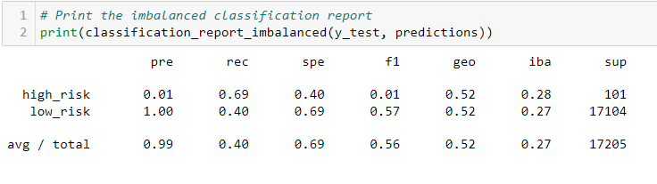
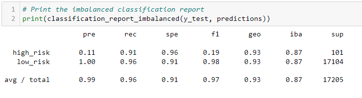

# Credit Risk Analysis
## Overview
&emsp; The main purpose of analyses done on the loan status data is to determine which machine learning model is best fit for this data and how accurate the model predicts the loan status. 

## Results
- Random Oversampling:
    - high risk precision very low: 1%
    - high risk revision above average: 64%
    - low risk precision extremely high: 100%
    - low risk revision above average: 60%
    - accuracy score above average: 62%  
  
- Balanced Random Forest Classifier
    - high risk precision very low: 4%
    - high risk revision above average: 68%
    - low risk precision extremely high: 100%
    - low risk revision also high: 90%
    - accuracy score fairly high: 79%  
  
- SMOTE:
    - high risk precision very low: 1%
    - high risk revision above average: 63%
    - low risk precision extremely high: 100%
    - low risk revision above average: 68%
    - accuracy score above average: 66%  
  
- SMOTEENN:
    - high risk precision very low: 1%
    - high risk revision above average: 68%
    - low risk precision extremely high: 100%
    - low risk revision above average: 59%
    - accuracy score above average: 63%  
  
- Cluster Centroids:
    - high risk precision very low: 1%
    - high risk revision above average: 69%
    - low risk precision extremely high: 100%
    - low risk revision above average: 40%
    - accuracy score lukewarm: 52%  

- Easy Ensemble Classifier:
    - high risk precision low: 11%
    - high risk revision very high: 91%
    - low risk precision extremely high: 100%
    - low risk revision very high: 96%
    - accuracy score very high: 93%  

## Summary
&emsp; Every one of the models, except for Easy Ensemble Classifier, has mediocre accuracy score. The precision rate of high risk profiles is low across the board, meaning none of these models really predict high risk profiles very precisely. With an average of 60% revision rate, these models also don't do well casting a net wide enough to predict all of the high risk profiles. The only model that is acceptable would be the Easy Ensemble Classifier. The reason being its having a much higher scores in high risk revision rate, low risk precision rate, and low risk revision rate. Even though the high risk precision rate is only 11%, with a revision rate of 91% you can count on most of the high risk profiles be predicted.  
&emsp; That being said, I would not recommend any of these models. In my professional opinion, a high high risk revision rate is more important in the trade off because you really don't want to have these profiles be flagged as low risk causing potential loss of investment. However, with a precision of 11%, it would take so much more time to sift through the predictions to find all of the low risk profiles.